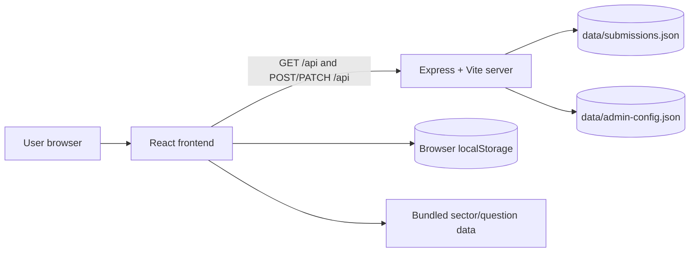
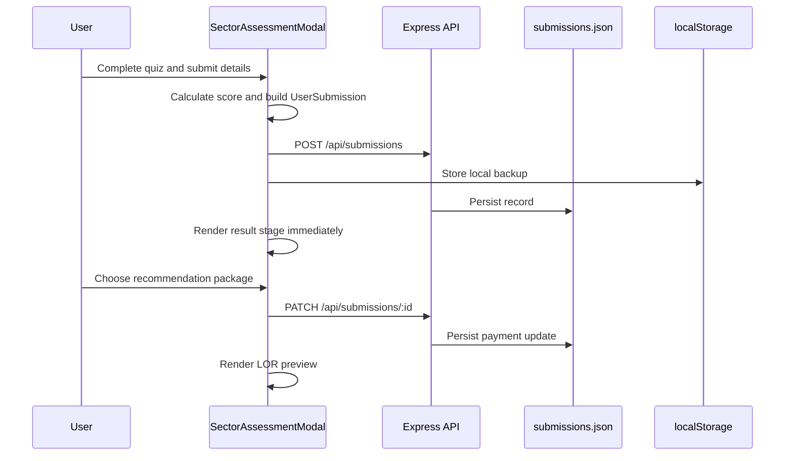

# Recamend Architecture

## Overview

Recamend is a React and TypeScript web application for exploring AI transformation across economic sectors, completing sector assessments, and generating recommendation-letter and referral information. The application runs as a single Node.js process in development:

- Express owns the API and persistent JSON storage.
- Vite serves and hot-reloads the React frontend.
- React owns navigation state, sector views, assessment state, and payment simulation state.
- Static sector and assessment content is bundled from `src/data`.

## System Context



## Runtime Structure

```text
pro2/
├── server.ts                 Express API, persistence, and Vite integration
├── vite.config.ts            React/Tailwind/Vite configuration
├── data/
│   ├── submissions.json      Candidate and payment records
│   └── admin-config.json     Persisted admin passkey configuration
└── src/
    ├── main.tsx              React entry point
    ├── App.tsx               Application shell and URL state
    ├── types.ts              Shared domain types
    ├── data/
    │   ├── sectorData.ts     Sector research content
    │   └── assessmentQuestions.ts
    └── components/           Page sections, navigation, and modals
```

## Frontend Architecture

`App.tsx` is the top-level state coordinator. It derives the current sector from `?id=<sector-id>` or a URL hash and renders one of three main states:

1. `WelcomeHero` for the initial entry screen.
2. `SectorDetailView` for a selected sector.
3. The exploration homepage containing `HeroSection`, `SectorGrid`, and `InfoSections`.

`Navbar`, `Footer`, and `GlobalSearchModal` provide shared navigation and search. `SectorDetailView` owns detail-page tabs and opens `SectorAssessmentModal`.

The assessment modal uses a local state machine:

```text
quiz -> form -> result -> lor_preview
```

- `quiz` stores selected answers and computes the score.
- `form` collects candidate details.
- `result` displays the score, answer review, and referral information.
- `lor_preview` displays the recommendation/certificate preview after the simulated payment flow.

Sector selection updates browser history with `pushState`; the `popstate` listener restores the selected sector on back/forward navigation.

## Backend Architecture

`server.ts` creates an Express application on port `3000` and attaches Vite middleware in development. In production it serves the built frontend from `dist` and falls back to `index.html` for client-side routes.

The backend loads submissions and admin configuration at startup into memory. Mutations update the in-memory cache and synchronously write the JSON files. This is suitable for local or low-volume use, but is not a replacement for a concurrent production database.

### API Surface

| Endpoint | Purpose | Authorization |
| --- | --- | --- |
| `GET /api/health` | Health check and submission count | Public |
| `POST /api/auth/verify` | Verify admin passkey | Passkey in body |
| `POST /api/auth/change-passkey` | Change admin passkey | Current passkey in body |
| `POST /api/submissions` | Create a candidate submission | Public |
| `PATCH /api/submissions/:id` | Update payment status and plan | Currently route-level lookup |
| `GET /api/submissions` | Admin dashboard data or HTML dashboard | Admin passkey for JSON |
| `DELETE /api/submissions/:id` | Delete one submission | Admin passkey |
| `POST /api/submissions/delete-multiple` | Delete selected submissions | Admin passkey |
| `POST /api/submissions/bulk-delete` | Delete by criteria | Admin passkey |
| `GET /api/submissions/export/csv` | Export submissions as CSV | Admin passkey |

## Submission Data Flow



Vite is configured to ignore `data/*.json` changes during development. This prevents backend persistence writes from triggering a frontend reload and resetting the assessment modal state.

## Data Ownership

- `src/data/sectorData.ts` and `src/data/assessmentQuestions.ts` own read-only product content.
- React component state owns transient UI state and the current assessment session.
- `localStorage.sector_submissions` is a browser-side backup of submitted records.
- `data/submissions.json` is the server-side local persistence store.
- `data/admin-config.json` stores the current admin passkey configuration.

## Development and Build

```bash
npm install
npm run dev
```

The development server is available at `http://localhost:3000`.

```bash
npm run build
npm start
```

`npm run build` creates the Vite frontend bundle and bundles `server.ts` into `dist/server.cjs`. `npm start` runs the production server.

## Operational Notes

- Set `ADMIN_PASSKEY` in the environment to override the default initial passkey.
- The payment flow is a UI simulation; it does not integrate with a payment provider.
- The JSON file store is process-local and synchronous. Use a database and proper authentication before deploying for multiple operators or high traffic.
- The frontend currently contains static research content and does not fetch sector data from the API.
